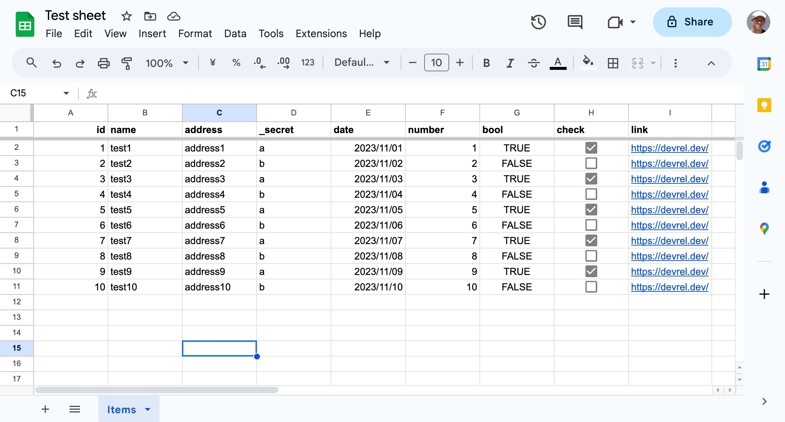
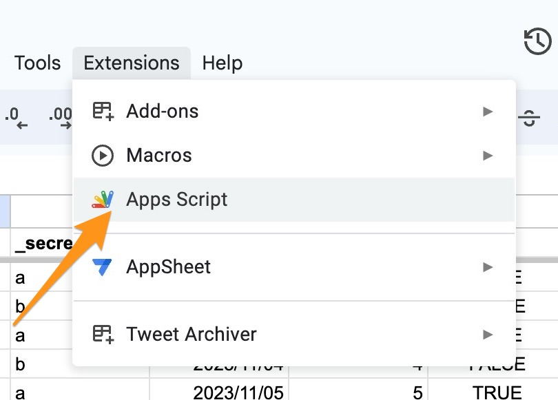
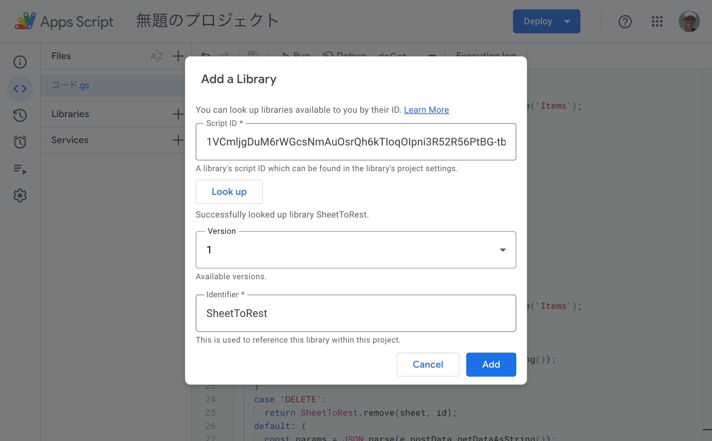
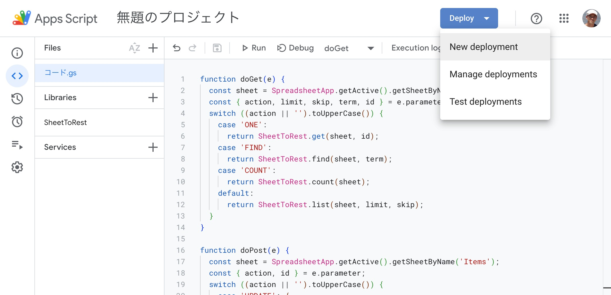
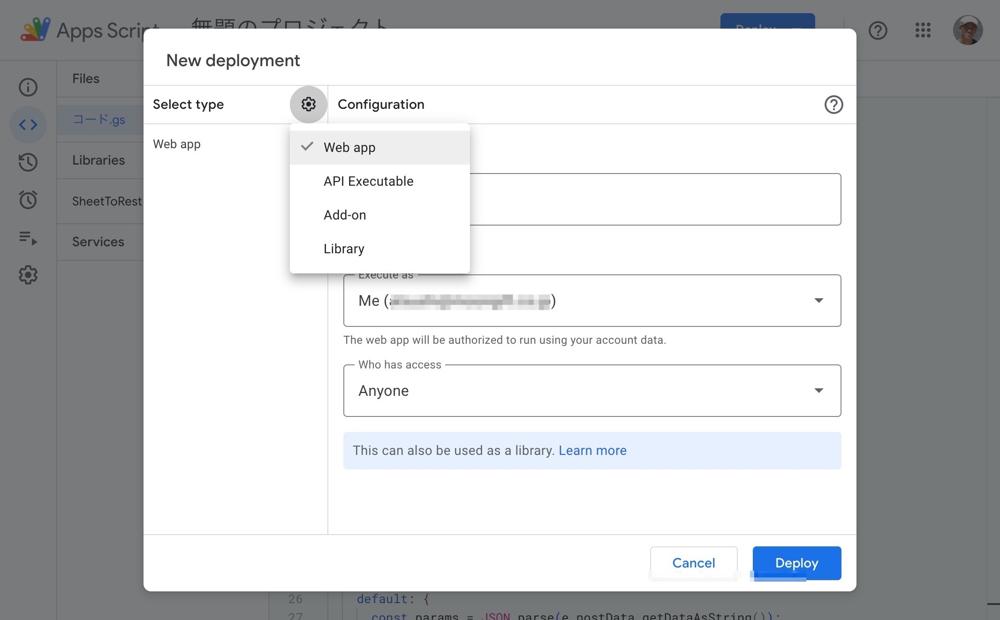
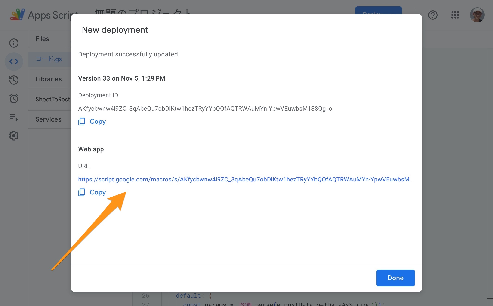

# Use Google Sheets as a REST API

This is Google Apps Script Library that provides REST API endpoint for Google Sheets.

[日本語での説明](https://qiita.com/goofmint/items/cb1a7798fdacd3ea012c)

## Set up

### 1. Create a new Google Sheet

Create a sheet.



* Default unique column name is `id`. (You can change it)
* If you want to hide the column, please add `_` to the beginning of the column name. (e.g. `_email`)

### Open Apps Script

Open Apps Script from Extensions menu.



### Add Library



Click `+` button to add a library. Script ID is below.

```
1VCmljgDuM6rWGcsNmAuOsrQh6kTIoqOIpni3R52R56PtBG-tb3_3Cdb2
```

Enter the Script ID and click `Look up`, and choose the latest version. Please don't change the identifier.

### Replace Code

Replace the code in the Code.gs file with the following:

* Please replace YOUR_SHEET_NAME with the name of the sheet you created in step 1.

```js
const sheetName = 'YOUR_SHEET_NAME';

function doGet(e) {
  const sheet = SpreadsheetApp.getActive().getSheetByName(sheetName);
  const { action, limit, skip, term, id } = e.parameter;
  switch ((action || '').toUpperCase()) {
    case 'ONE':
      return SheetToRest.get(sheet, id);
    case 'FIND':
      return SheetToRest.find(sheet, term);
    case 'COUNT':
      return SheetToRest.count(sheet);
    default:
      return SheetToRest.list(sheet, limit, skip);
  }
}

function doPost(e) {
  const sheet = SpreadsheetApp.getActive().getSheetByName(sheetName);
  const { action, id } = e.parameter;
  switch ((action || '').toUpperCase()) {
    case 'UPDATE': {
      const params = JSON.parse(e.postData.getDataAsString());
      return SheetToRest.update(sheet, id, params);
    }
    case 'DELETE':
      return SheetToRest.remove(sheet, id);
    default: {
      const params = JSON.parse(e.postData.getDataAsString());
      return SheetToRest.create(sheet, params);
    }
  }
}
```

### Deploy as Web App

Deploy as Web App from Deploy button.



Please choose `Anyone, even anonymous` for `Who has access to the app`.



### Get URL

Get the URL of the deployed Web App like below. This is the endpoint of the REST API.

```
https://script.google.com/macros/s/AKf...h91/exec
```



## Usage

Your endpioint is `URL` in this document.

### Create a record

```
% curl -H "Content-Type: application/json" \
	-d '{"name": "User 1", "address": "address 1"}' \
	-L \
	"URL"
{"name":"User 1","address":"address 1","id":"65fe3b74-ef3a-4642-a327-82a84ee6b689"}
```

You can add unique id. If you don't add id, the API will be generate a unique id by UUID.

```
% curl -H "Content-Type: application/json" \
	-d '{"id": 999, "name": "User 1", "address": "address 1"}' \
	-L \
	"URL"
{"name":"User 1","address":"address 1","id":"999"}
```

If there is a same id in records, the API will be return the error.

```
% curl -H "Content-Type: application/json" \
	-d '{"id": 999, "name": "User 1", "address": "address 1"}' \
	-L \
	"URL"
{error: 'duplicate'}
```

### Get a record

```
% curl -H "Content-Type: application/json" \
	-L "URL?action=one&id=YOUR_RECORD_ID" | jq
{
  "id": "65fe3b74-ef3a-4642-a327-82a84ee6b689",
  "name": "User 1",
  "address": "address 1",
  "_secret": "",
  "date": "",
  "number": "",
  "bool": "",
  "check": "",
  "link": ""
}
```

If there is no record, the API will be return the error.

```
{error: 'not found'}
```

### Get records

```
% curl -H "Content-Type: application/json" -L "URL?limit=2" | jq
[
  {
    "id": 1,
    "name": "test1",
    "address": "address1",
    "date": "2023-10-31T15:00:00.000Z",
    "number": 1,
    "bool": true,
    "check": true,
    "link": "https://devrel.dev/"
  },
  {
    "id": 2,
    "name": "test2",
    "address": "address2",
    "date": "2023-11-01T15:00:00.000Z",
    "number": 2,
    "bool": false,
    "check": false,
    "link": "https://devrel.dev/"
  }
]
```

### Search records

```
% curl -H "Content-Type: application/json" \
	-L "URL?action=find&term=address3" | jq
[
  {
    "id": 3,
    "name": "test3",
    "address": "address3",
    "_secret": "a",
    "date": "2023-11-02T15:00:00.000Z",
    "number": 3,
    "bool": true,
    "check": true,
    "link": "https://devrel.dev/"
  }
]
```

### Update a record

```
% curl -H "Content-Type: application/json" \
	-d '{"name": "User 2"}' \
	-L "URL?action=update&id=YOUR_RECORD_ID" | jq
{
  "id": "YOUR_RECORD_ID",
  "name": "User 2",
  "address": "address 1",
  "_secret": "",
  "date": "",
  "number": "",
  "bool": "",
  "check": "",
  "link": ""
}
```

If there is no record, the API will be return the error.

```
{error: 'not found'}
```

### Delete a record

```
% curl -H "Content-Type: application/json" \
	-d '{}' \
	-L "URL?action=delete&id=65fe3b74-ef3a-4642-a327-82a84ee6b689" | jq
{
  "result": "ok"
}
```

If there is no record, the API will be return the error.

```
{
  "error": "not found"
}
```

### Count records

```
% curl -H "Content-Type: application/json" \
	-L "URL?action=count" | jq 
{
  "count": 11
}
```

## Using API with frontend

You can use this API in your frontend project.

```js
const url = 'URL?action=one&id=YOUR_RECORD_ID';
const res = await fetch(url);
const json = await res.json();
```

## License

MIT


